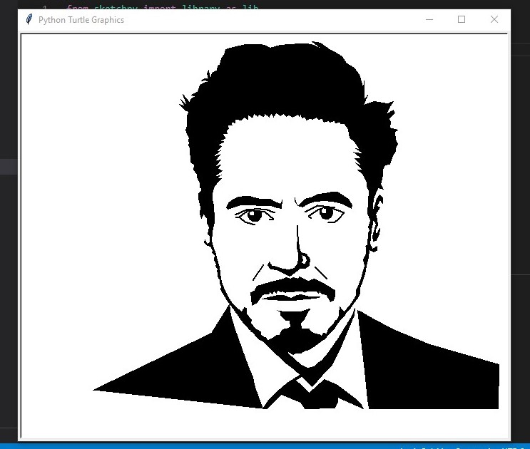

# Welcome to sketchpy

<h2>Intro to the project and some quick information,followed by an image of the project.<h2>

<div align="center">
    </a>
</div>

## Description

This is the beginning level python project to do some awesome drawing animation using the `turtle` module, hope it grows in the future

### Usage

- Just install the package `pip install sketchpy`
- Import it to you project `import sketchpy` and use as you want😊

### Built with

- Turtle 
- Open-cv
- Pillow

## Getting started

### Prerequisites

- Python
- Basic text editor
- creativity😂

### Install

```
    pip install sketchpy
```
it should probably work, If not then try the following code
    
```
    pip install turtle open-cv wheel sketchpy
```


### Example

```
    from sketchpy import library as lib
    

    obj = lib.rdj()
    obj.draw()
```

### OUTPUT
<div align = "center">
   
</div>

    
### More examples

```
    from sketchpy import library as lib
    
    obj = lib.bts()
    obj.draw()
```

```
    from sketchpy import library as lib

    obj = lib.vijay()
    obj.draw()
```
<div align = 'center' style = "display: flex; justify-content: space-between;"> 


</div>
    
# Drawing from SVG file
    
Use the following code to draw a file from svg file, insted of tracing full image
    
NOTE: use this specific website to convert image to svg, sketchpy is specifically 
      made to work with this website only
    
```
    from sketchpy import canvas
    obj = canvas.draw_from_svg('FILE PATH')
    obj.draw()
```
    
# Saving a loaded svg file

Insted of waiting for the svg file to load, you can save as .npy file and use that for future use
    
```
    from sketchpy import canvas
    obj = canvas.sketch_from_svg('FILE PATH')
    obj.load_svg(filename = 'data.npy')
```

## Drawing form .npy file

use the following code to draw your image from saved data file
    
```
    from sketchpy import canvas
    obj = canvas.sketch_from_svg('FILE PATH')
    obj.draw(filename = 'data.npy')
``` 

### Troubleshooting

- If you find any problem, you can pull request, or contact me on either [insta](https://www.instagram.com/mr.m_y_s_t_e_r_y/) or [discord](https://discord.gg/r2KFa73PM2)
- You can also find video on my [youtube channel](https://www.youtube.com/playlist?list=PLb1Kbw_2jl_mr3A_cl6pXA1N5lwtHCx_7)


### Acknowledgements

Thanks to all who helped inspire this project.❤

### See also

- [Youtube Videos](https://www.youtube.com/playlist?list=PLb1Kbw_2jl_mr3A_cl6pXA1N5lwtHCx_7)
- [Related Blogs](https://codehub0.blogspot.com/)
- [Contact me on Discord](https://discord.gg/r2KFa73PM2)
- [My insta ID](https://www.instagram.com/mr.m_y_s_t_e_r_y/)


### License

This project is licensed under the [MIT License](https://github.com/MRMYSTERY003/sketchpy/blob/main/LICENSE).
